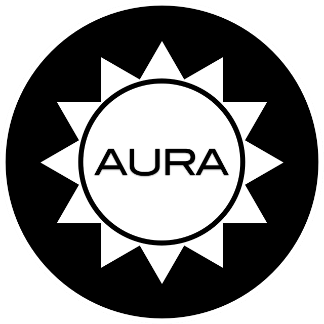

    

        
        <h3></h3>
        
<a class="btn btn-primary btn-large" href="/about">Learn more &raquo;</a>

    

    

        <table id="packages">
            <thead><tr>
                <th>Package</th>
                <th>Composer</th>
                <th>Description</th>
            </tr></thead>
        </table>
        
    

    

        <h2>About</h2>
        

            The primary goal of Aura is to provide high-quality, well-tested,
            <a href="http://php-fig.org">standards-compliant</a>, decoupled
            libraries that can be used in any codebase. This means you can use
            as much or as little of the project as you like.
        

        
<a class="btn" href="/about">Read more &raquo;</a>

    

    

        <h2>Packages</h2>
        

            The Aura project centers around a collection of independent
            packages. Each package is self-contained and has only the things
            it needs for its core purpose. None of the packages depends on any
            of the other; you can download and use each of the packages on its
            own.
        

        
<a class="btn" href="/packages">Read more &raquo;</a>

    

    <!-- 

        <h2>Framework</h2>
        

            Aura has enough libraries to form a full-stack framework of its
            own. A system repository is available to incorporate them all into
            a coherent framework for application development.
        

        
<a class="btn" href="/framework">Read more &raquo;</a>

    
 -->

